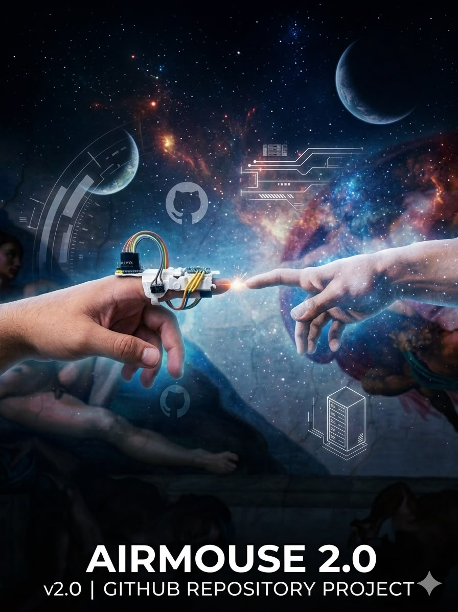

# ESP32-C3 BLE Hava Faresi



ESP32-C3 Super Mini ve MPU6050 ile geliştirilen Bluetooth Düşük Enerji (BLE)
tabanlı bir hava faresidir. Bilgisayarda ek uygulama veya USB yardımcı yazılımı
gerektirmez; `C3 AirMouse BLE` adıyla standart bir Bluetooth fare olarak görünür.

## Özellikler

- MPU6050 jiroskopuyla imleç hareketi
- Küçük el titreşimlerini engelleyen ölü bölge
- Yumuşatma ve yavaş kayma telafisi
- GPIO0'a kısa basınca sağ tıklama
- GPIO0'a basılı tutup cihazı eğince dikey kaydırma
- GPIO1 basılı tutulduğu sürece sol fare tuşunu basılı tutma
- İsteğe bağlı dahili BOOT/GPIO9 düğmesi desteği
- Windows, Linux ve BLE HID fare destekleyen diğer sistemlerle eşleşme
- Proje içinde bulunan NimBLE tabanlı HID katmanı
- Sabitlenmiş sürümlerle tekrarlanabilir Arduino CLI derlemesi

## Gerekli Donanım

- ESP32-C3 Super Mini (`nologo_esp32c3_super_mini`)
- MPU6050 (GY-521 veya uyumlu modül)
- İki adet anlık basmalı düğme
- Bağlantı kabloları

## Pin Şeması

| ESP32-C3 Super Mini | Bağlantı | Açıklama |
| --- | --- | --- |
| 3V3 | MPU6050 VCC | Sensör beslemesi |
| GND | MPU6050 GND | Ortak toprak |
| GPIO3 | MPU6050 SDA | I2C veri hattı |
| GPIO4 | MPU6050 SCL | I2C saat hattı |
| GPIO0 | Düğme 1, diğer ucu GND | Kısa bas: sağ tık; basılı tut ve eğ: kaydırma |
| GPIO1 | Düğme 2, diğer ucu GND | Basılı tut: sol fare tuşu basılı |

Düğmeler dahili `INPUT_PULLUP` ile okunur; harici direnç gerekmez. GPIO0 ve
GPIO9 açılış davranışını etkileyebilen pinlerdir. Kart açılırken veya
sıfırlanırken bu düğmeleri basılı tutmayın.

## Arduino IDE ile Kurulum

1. Kart Yöneticisi'ne Espressif ESP32 paket adresini ekleyin:
   `https://espressif.github.io/arduino-esp32/package_esp32_index.json`
2. `esp32` kart paketinin `3.3.2` sürümünü kurun.
3. Kütüphane Yöneticisi'nden `NimBLE-Arduino 2.3.4` ve
   `MPU6050_light 1.2.1` kütüphanelerini kurun.
4. `ESP32-C3-BLE-AirMouse.ino` dosyasını açın ve ESP32-C3 Super Mini kartını seçin.
5. Doğru seri portu seçip yazılımı karta yükleyin.

## Arduino CLI ile Derleme

`sketch.yaml`, kart paketini ve kütüphane sürümlerini sabitler. Arduino CLI,
eksik bağımlılıkları yalıtılmış bir ortamda indirip projeyi derler:

```powershell
arduino-cli compile --profile esp32c3 .
```

Karta yüklemek için kendi portunuzu kullanın:

```powershell
arduino-cli upload --profile esp32c3 -p COM22 .
```

## Kullanım

1. Kartı düz ve hareketsiz bırakıp açın. İlk kalibrasyon yaklaşık 2,5 saniye sürer.
2. Bilgisayarın Bluetooth ayarlarından `C3 AirMouse BLE` aygıtını eşleştirin.
3. Kartı bileğinizle eğerek imleci hareket ettirin.
4. GPIO0 düğmesine kısa basıp bırakarak sağ tıklayın. Düğmeyi basılı tuttuktan
   sonra kartı yukarı veya aşağı eğerek sayfayı kaydırın.
5. GPIO1 düğmesini basılı tuttuğunuz sürece sol fare tuşu basılı kalır.

Eski bir yazılımla eşleşme sorunu yaşarsanız bilgisayardaki eski
`C3 AirMouse BLE` kaydını silin, kartı yeniden başlatın ve tekrar eşleştirin.
Seri monitör hızı `115200` baud'dur. `DURUM` satırları Bluetooth ve sensör
durumunu gösterir.

## Hassasiyet Ayarları

Hareket davranışı ana `.ino` dosyasındaki sabitlerle değiştirilebilir:

- `SENSITIVITY`: imleç hızı (`0.93`)
- `DEAD_ZONE`: sabit eldeki küçük titreşimleri yok sayma (`1.15`)
- `SMOOTHING`: hareket yumuşatma (`0.58`)
- `BUTTON_SCROLL_INTERVAL_MS`: kaydırma tekrar aralığı (`115 ms`)
- `BLE_SCROLL_STEPS`: her kaydırma raporundaki adım sayısı (`3`)

## Pil Güvenliği

LiPo/Li-ion pili kartın USB veya 5V pinine doğrudan bağlayarak şarj etmeyin.
Kartın 5V hattı bir pil şarj denetleyicisi değildir; akım sınırlama, 4,2V
gerilim kontrolü ve şarj sonlandırma sağlamaz. Özellikle 100 mAh gibi küçük
piller için, pil üreticisinin izin verdiği düşük şarj akımına ayarlanabilen
1S LiPo şarj ve koruma devresiyle uygun bir regülatör veya güç yolu kullanın.
Standart olarak 1 A'a ayarlanmış TP4056 modülleri 100 mAh pil için uygun değildir.

## Lisans

Proje [MIT Lisansı](LICENSE) ile yayımlanır. Lisansın kolay okunabilen
[Türkçe çevirisi](LISANS-TR.md) ayrıca sunulmuştur. `LICENSE` dosyasında hukuken
tanınan özgün metin korunmuştur. Harici `NimBLE-Arduino` ve `MPU6050_light`
kütüphaneleri kendi lisansları altındadır.
